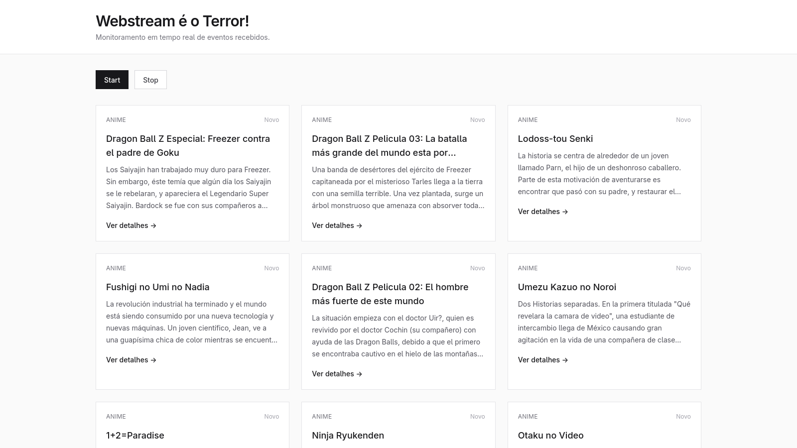

# 🌊 Web Streams with Node.js and Browser

A practical project demonstrating how to use the **Web Streams API** in both Node.js and the browser to process large amounts of data efficiently without blocking the UI or exhausting memory.

## 📸 Demo

The frontend receives events from the server as they are generated and updates the interface in real time, demonstrating how browser streams can be used to process continuous data flows.

## 📖 About

This repository was created as a learning resource for developers who want to understand how streaming works in modern JavaScript applications.

Instead of waiting for an entire response to be downloaded and parsed, data is processed incrementally as it arrives, enabling better performance and scalability.

Through this project, you'll learn how to:

* Consume streamed data from a Node.js server.
* Process data incrementally in the browser.
* Work with Readable Streams.
* Build real-time user interfaces.
* Reduce memory consumption when handling large datasets.
* Create efficient data processing pipelines.

## 🚀 Technologies

* Node.js
* JavaScript
* Web Streams API
* Fetch API
* HTML
* Tailwind CSS

### Install dependencies

```bash
cd app
npm install
cd ..
cd server
npm install
```

### Start the application

```bash
```bash
cd app
npm start
cd ..
cd server
npm start
```

### Open your browser

```text
http://localhost:8000
```

## 💡 Why Streams?

Traditional applications often load the entire response into memory before processing it.

Streams allow applications to:

* Start processing data immediately.
* Handle large datasets efficiently.
* Improve perceived performance.
* Reduce memory usage.
* Build responsive real-time experiences.

---

Built with ❤️ by Daniel Damasio
